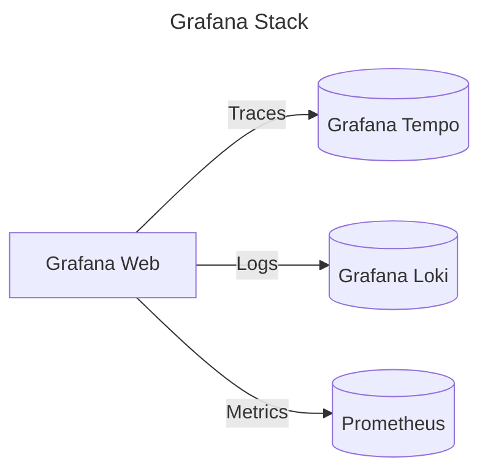

# 📊 Grafana Stack Deployment

This directory contains the Helm chart `values.yaml` files for deploying the Grafana stack:

- **Grafana Web**: The main UI for visualizing telemetry data (traces, logs, and metrics).
- **Grafana Tempo**: Distributed tracing backend for managing and viewing traces.
- **Grafana Loki**: Log aggregation system for managing logs.
- **Prometheus**: Metrics aggregation and TSDB.



## 🚀 Deployment Steps

1. **Deploy**:

    You can use `Makefile`.

    ```bash
    make grafana-stack
    ```

2. **Access Grafana Web**:

    To access the Grafana Web UI, use the following command to port-forward Grafana:

    ```bash
    make grafana-port-forward
    ```

    Then, open your browser and go to: [http://localhost:8080](http://localhost:8080)  
    Default credentials:
    - **Username**: `admin`
    - **Password**: `admin`
