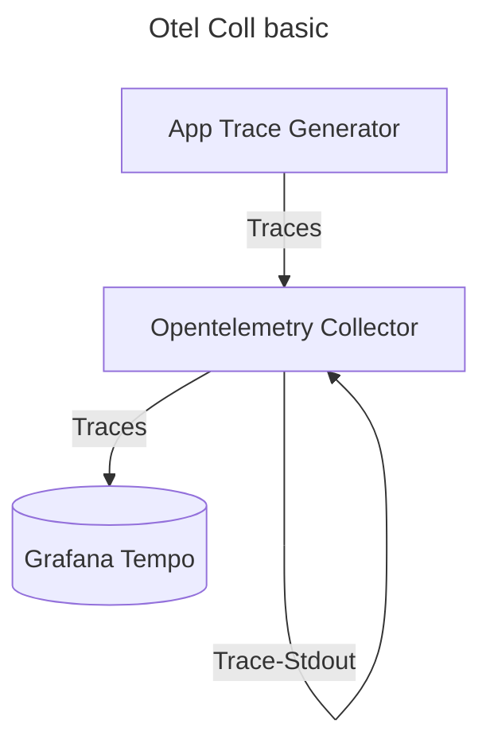

# OpenTelemetry Collector - Basic Config 🚀 

This setup deploys a basic OpenTelemetry Collector in a Kubernetes cluster using the configuration provided in [collector-config](configmap.yaml).



## Components 🧩 

- **Receivers**: OTLP with protocol gRPC and HTTP
- **Processors**: Batch
- **Exporters**: OTLP to `tempo.monitoring.svc.cluster.local:4317`
- **Extensions**: Health

## Available Commands 📝

To see the list of available commands, run the following command:

```bash
make help
```

Make help Output 📋

```bash
help              Show help message
create-namespace  Create the monitoring namespace
apply-config      Apply OpenTelemetry Collector config, deployment, and service
status            Get the status of the deployed OpenTelemetry Collector pods
logs              Get the logs of the deployed OpenTelemetry Collector pods
port-forward      Port forward the OpenTelemetry Collector service
delete            Delete the OpenTelemetry Collector deployment and service
```

## How to Deploy 📦


1. Create the `opentelemetry` namespace if not already created:

```bash
make create-namespace
```

2. Apply the ConfigMap, OpenTelemetry Deployment, Service and Trace Generator:

```bash
make apply-config
```

You can verify if the OpenTelemetry Collector is running:

```bash
make status
```

You can verify the OpenTelemetry Collector logs:

```bash
make logs
```
